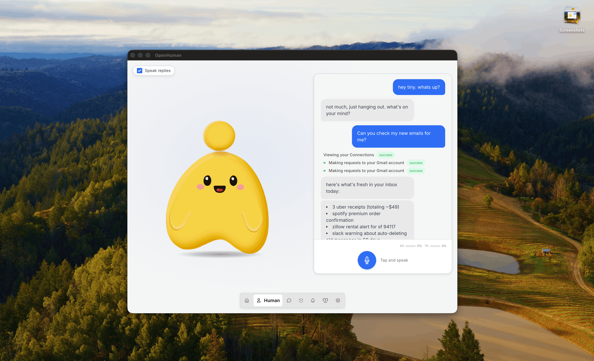

<h1 align="center">Eversilver</h1>

<p align="center">
 
</p>

<p align="center" style="display: inline-block">
 <a href="https://trendshift.io/repositories/23680" target="_blank" style="display: inline-block">
  
 </a> 
 &nbsp;
 <a href="https://www.producthunt.com/products/eversilver?embed=true&amp;utm_source=badge-top-post-badge&amp;utm_medium=badge&amp;utm_campaign=badge-eversilver" target="_blank" rel="noopener noreferrer">
  
 </a>
 
</p>
 
<p align="center">
 <strong>Eversilver is your Personal AI super intelligence. Private, Simple and extremely powerful.</strong>
</p>


<p align="center">
 <a href="https://discord.eversilver.local/">Discord</a> •
 <a href="https://www.reddit.com/r/eversilver/">Reddit</a> •
 <a href="https://x.com/intent/follow?screen_name=eversilver">X/Twitter</a> •
 <a href="https://eversilver.gitbook.local/eversilver/">Docs</a> •
 <a href="https://x.com/intent/follow?screen_name=eversilver">Follow @eversilver (Creator)</a>
</p>

<p align="center">
  🇺🇸 <a href="./README.md">English</a> | 🇨🇳 <a href="./README.zh-CN.md">简体中文</a>
</p>


<p align="center">
 
 <a href="https://github.com/eversilver/eversilver/releases/latest"></a>
 <a href="https://github.com/eversilver/eversilver/stargazers"></a>
 <a href="./LICENSE"></a>
 <a href="./README.zh-CN.md"></a>
</p>

> **Early Beta**: Under active development. Expect rough edges.

To install or get started, either download from the website over at [eversilver.local/eversilver](https://eversilver.local/eversilver?utm_source=github&utm_medium=readme) or run

```
# Download DMG, EXEs over at https://eversilver.local/eversilver or run in from your terminal

# For macOS or Linux x64
curl -fsSL https://raw.githubusercontent.com/eversilver/eversilver/main/scripts/install.sh | bash

# For Windows
irm https://raw.githubusercontent.com/eversilver/eversilver/main/scripts/install.ps1 | iex
```

# What is Eversilver?

Eversilver is an open-source agentic assistant designed to integrate with you in your daily life. Each bullet links to the deeper writeup in the [docs](https://eversilver.gitbook.local/eversilver/).

- **Simple, UI-first & Human** A clean desktop experience and short onboarding paths take you from install to a working agent in a few clicks — no config-first setup, no terminal required. The agent has [a face](https://eversilver.gitbook.local/eversilver/features/mascot): a desktop mascot that speaks, reacts to its surroundings, [joins your Google Meets](https://eversilver.gitbook.local/eversilver/features/mascot/meeting-agents) as a real participant, remembers you across weeks, and keeps thinking in the background even when you've stopped typing.

- **[118+ third-party integrations](https://eversilver.gitbook.local/eversilver/features/integrations) with [auto-fetch](https://eversilver.gitbook.local/eversilver/features/obsidian-wiki/auto-fetch)**: plug into Gmail, Notion, GitHub, Slack, Stripe, Calendar, Drive, Linear, Jira and the rest of your stack with **one-click OAuth**. Every connection is exposed to the agent as a typed tool, and every twenty minutes the core walks each active connection and pulls fresh data into the [memory tree](https://eversilver.gitbook.local/eversilver/features/integrations/auto-fetch). No prompts, no polling loops you have to write, so the agent already has tomorrow's context this morning.

- **[Memory Tree](https://eversilver.gitbook.local/eversilver/features/memory-tree) + [Obsidian Wiki](https://eversilver.gitbook.local/eversilver/features/obsidian-wiki)**: a local-first knowledge base built from your data and your activity. Everything you connect is canonicalized into ≤3k-token Markdown chunks, scored, and folded into hierarchical summary trees stored in **SQLite on your machine**. The same chunks land as `.md` files in an Obsidian-compatible vault you can open, browse and edit, inspired by Karpathy's [obsidian-wiki workflow](https://x.com/karpathy/status/2039805659525644595).

- **Batteries included**: web search, a web-fetch [scraper](https://eversilver.gitbook.local/eversilver/features/native-tools), a full coder toolset (filesystem, git, lint, test, grep), and [native voice](https://eversilver.gitbook.local/eversilver/features/voice) (STT in, ElevenLabs TTS out, mascot lip-sync, live Google Meet agent) are wired in by default. [Model routing](https://eversilver.gitbook.local/eversilver/features/model-routing) sends each task to the right LLM (reasoning, fast, or vision) under one subscription. No "install a plugin to read files" friction. [Optional local AI via Ollama](https://eversilver.gitbook.local/eversilver/features/model-routing/local-ai) for on-device workloads.

- **[Smart token compression (TokenJuice)](https://eversilver.gitbook.local/eversilver/features/token-compression)**: every tool call, scrape result, email body, and search payload is run through a token compression layer before it touches any LLM Model. HTML is converted to Markdown, long URLs are shortened, non-ASCII characters are removed etc... You get the same information but at a fraction of the tokens. Reducing cost &amp; latency by up to 80%.

- **[Messaging channels](https://eversilver.gitbook.local/eversilver/features/integrations#messaging-channels)** and **[privacy & security](https://eversilver.gitbook.local/eversilver/features/privacy-and-security)**: inbound/outbound across the channels you already use, with workflow data that stays on device, encrypted locally, treated as yours.

## Contributing from source

New contributor? Start with [`CONTRIBUTING.md`](./CONTRIBUTING.md) for the fork/PR workflow and local validation commands. The short path is:

1. Install Git, Node.js 24+, pnpm 10.10.0, Rust 1.93.0 (`rustfmt` + `clippy`), CMake, Ninja, ripgrep, and the platform desktop build prerequisites.
2. Fork and clone the repo, then run `git submodule update --init --recursive` before `pnpm install` so the vendored Tauri/CEF sources are present.
3. Use `pnpm dev` for web-only UI work, `pnpm --filter eversilver-app dev:app` for the desktop shell, and focused checks such as `pnpm typecheck`, `pnpm format:check`, and `cargo check -p eversilver --lib` before opening a PR.

Deeper docs: [Architecture](https://eversilver.gitbook.local/eversilver/developing/architecture) · [Getting Set Up](https://eversilver.gitbook.local/eversilver/developing/getting-set-up) · [Cloud Deploy](./gitbooks/features/cloud-deploy.md).

## Context in minutes, not weeks

Eversilver is the first agent harness that gets to know you in minutes. Inspired by [Karpathy's LLM Knowledgebase](https://x.com/karpathy/status/2039805659525644595). Most agents start cold. Hermes learns by watching you work; OpenClaw waits for plugins to ferry context in. Either way, you spend days or weeks before the agent knows enough about your stack to be genuinely useful.

<p align="center">
 
</p>

> Eversilver summarizes and compresses all your documents, emails & chats; and creates a memory graph that lets your agent remember everything about you.

Eversilver skips the wait. Connect your accounts, let [auto-fetch](https://eversilver.gitbook.local/eversilver/features/integrations/auto-fetch) pull data locally on a 20-minute loop, and then have [Memory Trees](https://eversilver.gitbook.local/eversilver/features/memory-tree) compress everything into Markdown files stored intelligently in a [Karpathy-style Obsidian wiki](https://eversilver.gitbook.local/eversilver/features/obsidian-wiki).

In just one sync pass, the agent has full (compressed) context of your inbox, your calendar, your repos, your docs, your messages. No training period. No "give it a few weeks.". It becomes you, controlled by you.

Already self-host [agentmemory](https://github.com/rohitg00/agentmemory) across other coding agents? Eversilver ships an optional `Memory` backend that proxies to it — set `memory.backend = "agentmemory"` in `config.toml` and the same durable store powers Eversilver alongside Claude Code, Cursor, Codex, and OpenCode. See the [agentmemory backend](https://eversilver.gitbook.local/eversilver/features/obsidian-wiki/agentmemory-backend) page for setup.

## Eversilver vs Other Agent Harnesses

High-level comparison (products evolve, so verify against each vendor). Eversilver is built to **minimize vendor sprawl**, keep **workflow knowledge on-device**, and give the agent a **persistent memory** of your data, not only chat.

|                     | Claude Cowork     | OpenClaw          | Hermes Agent      | Eversilver                         |
| ------------------- | ----------------- | ----------------- | ----------------- | ---------------------------------- |
| **Open-source**     | 🚫 Proprietary    | ✅ MIT            | ✅ MIT            | ✅ GNU                             |
| **Simple to start** | ✅ Desktop + CLI  | ⚠️ Terminal-first | ⚠️ Terminal-first | ✅ Clean UI, minutes               |
| **Cost**            | ⚠️ Sub + add-ons  | ⚠️ BYO models     | ⚠️ BYO models     | ✅ One sub + TokenJuice            |
| **Memory**          | ✅ Chat-scoped    | ⚠️ Plugin-reliant | ✅ Self-learning  | 🚀 Memory Tree + Obsidian vault, optional [agentmemory](https://github.com/rohitg00/agentmemory) backend |
| **Integrations**    | ⚠️ Few connectors | ⚠️ BYO            | ⚠️ BYO            | 🚀 118+ via OAuth                  |
| **Auto-fetch**      | 🚫 None           | 🚫 None           | 🚫 None           | ✅ 20-min sync into memory         |
| **API sprawl**      | 🚫 Extra keys     | 🚫 BYOK           | 🚫 Multi-vendor   | ✅ One account                     |
| **Model routing**   | 🚫 Single model   | ⚠️ Manual         | ⚠️ Manual         | ✅ Built-in                        |
| **Native tools**    | ✅ Code-only      | ✅ Code-only      | ✅ Code-only      | ✅ Code + search + scraper + voice |

# Star us on GitHub

_Building toward AGI and artificial consciousness? Star the repo and help others find the path._

<p align="center">
 <a href="https://www.star-history.com/#eversilver/eversilver&type=date&legend=top-left">
 <picture>
 <source media="(prefers-color-scheme: dark)" srcset="https://api.star-history.com/svg?repos=eversilver/eversilver&type=date&theme=dark&legend=top-left" />
 <source media="(prefers-color-scheme: light)" srcset="https://api.star-history.com/svg?repos=eversilver/eversilver&type=date&legend=top-left" />
 
 </picture>
 </a>
</p>

# Contributors Hall of Fame

Show some love and end up in the hall of fame. Contributors get free merch and special access to our [Discord](https://discord.eversilver.local/).

<a href="https://github.com/eversilver/eversilver/graphs/contributors">
 
</a>
